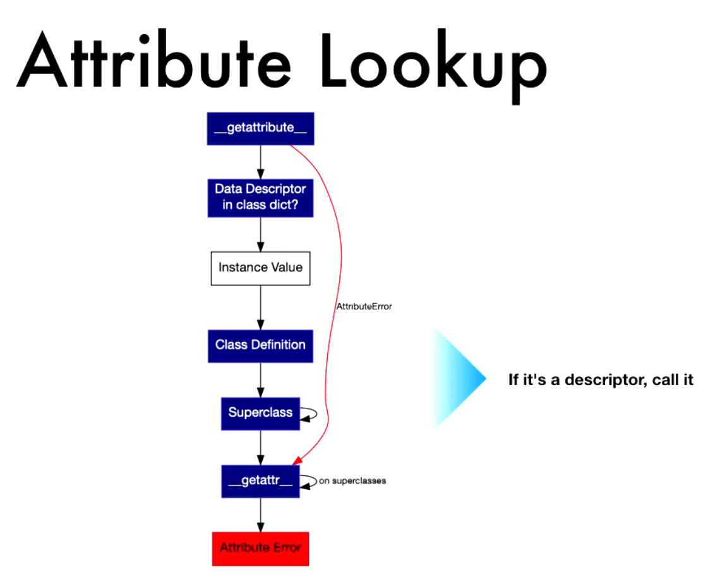

# EDU-Notes-From-Python-Conferences

## Images from Types and Metaclasses talk (types_and_metaclasses.ipynb)
### Attribute Lookup from types_and_metaclasses.ipynb

### Inheritance Model of Metaclasses

### Instance Attribute Lookup

### Instanception

